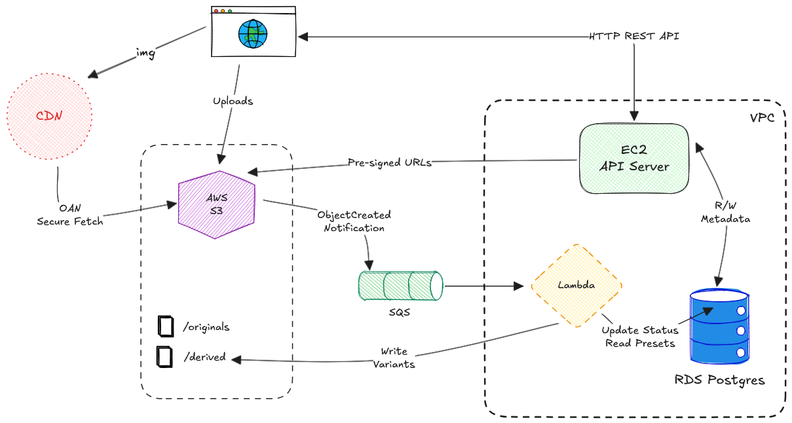

# BrandKit

#### Digital Asset Management System
A system for uploading, processing, and delivering images at scale.

This application lets users upload images, automatically creates different sizes of those images, and serves them fast to users anywhere in the world.



Architecture decisions are recorded in [docs/adr](docs/adr/README.md). A review of the code against those decisions is in [docs/audit](docs/audit/2026-10-07-code-audit.md).

## Repository layout

| Path | What it is |
| --- | --- |
| `server/` | Express API (TypeScript) and `schema.sql` |
| `lambdas/image-processor/` | Worker that creates image variants (SQS -> Lambda) |
| `lambdas/cleanup/` | Asset deletion worker (written, not deployed yet, see ADR 0012) |
| `web/` | React app (Vite) |
| `infrastructure/terraform/` | All AWS resources |
| `infrastructure/certs/` | Amazon RDS CA bundle used to verify database TLS |
| `docs/` | ADRs and audit |

## Main Parts

### API Server (EC2)
A Node.js/Express application on an EC2 instance, run as an unprivileged systemd service. It handles synchronous API requests, manages metadata and signs direct-to-S3 upload forms. It is only reachable through CloudFront (`/api/*`) over HTTPS.

### Database (RDS PostgreSQL)
The source of truth for asset metadata, user-defined presets and variant information. Uses transactions, cascading deletes and uniqueness constraints for integrity.

### Storage (Amazon S3)
Private, encrypted storage for all images. Two prefixes:
- `originals/` - uploaded images (`originals/{assetId}/original.{ext}`)
- `derived/` - generated variants (`derived/{presetId}/{assetId}.{ext}`)

### Processing Worker (Lambda + SQS)
When a new image is uploaded, the worker:
- Downloads the original and checks its size and that it is a valid image
- Creates one variant per preset with `sharp` (auto-rotated from EXIF)
- Saves the variants back to storage with long-lived cache headers
- Records the variants and marks the asset `processed`

Processing is idempotent: duplicate or retried messages never turn a finished asset into a failed one. Images that cannot be processed are marked `failed` with a reason; unexpected errors are retried and finally land in a dead-letter queue (with an alarm).

### Content Delivery (CloudFront)
One CloudFront distribution serves both images (`/*`, cached, from the private bucket via Origin Access Control) and the API (`/api/*`, never cached).

### Network (VPC)
The API host is in a public subnet. RDS and the Lambda are in private subnets with no internet route; the Lambda reaches S3 through a free S3 gateway endpoint, so no NAT gateway is needed.

## System Flows

### Asset Upload & Processing

1. User selects an image in the web app (type and size are checked in the browser).
2. App calls `POST /api/v1/assets`. The API validates the request, generates an asset ID and returns a **presigned POST form** for `originals/{assetId}/original.{ext}`, then records a `pending` asset.
3. The browser POSTs the file straight to S3. S3 itself rejects files over the size limit (`MAX_UPLOAD_BYTES`, default 10 MiB) or with a different content type than declared. The form is valid for 15 minutes and can be reused until then.
4. S3 sends an ObjectCreated notification to SQS.
5. The SQS message triggers the worker, which reads the presets from RDS, generates all variants, uploads them to `derived/`, and records them.
6. The worker sets the asset to `processed` (or `failed`). The web app polls while recent assets are still pending or processing.

### Asset Delivery

1. User opens a page that needs images.
2. App asks the API for assets; the response contains CloudFront URLs and a thumbnail URL per asset.
3. Browser loads images from CloudFront, which serves from cache or fetches from S3.

## Technology Stack

- **Frontend**: React 19, Vite, TanStack Query
- **Backend**: Node.js 20 + Express 5
- **Database**: PostgreSQL 17 (AWS RDS)
- **Storage**: AWS S3
- **Processing**: AWS Lambda (Node.js 22) + sharp
- **Queue**: AWS SQS
- **CDN**: AWS CloudFront
- **Infrastructure**: Terraform, AWS VPC
- **Region**: ap-south-1 (Mumbai)

## Local development (no AWS account needed for the API and database)

```bash
# 1. PostgreSQL with the schema
docker run -d --name brandkit-pg -e POSTGRES_PASSWORD=pw -e POSTGRES_DB=brandkitdb -p 5432:5432 postgres:17-alpine
docker exec -i brandkit-pg psql -U postgres -d brandkitdb < server/schema.sql

# 2. API
cd server
cp .env.example .env     # set DB_USER=postgres, DB_PASSWORD=pw; any AWS_* values work unless you call POST /assets
npm ci
npm run dev
```

`POST /api/v1/assets` signs an S3 form, so it needs AWS credentials in the environment (any fake `AWS_ACCESS_KEY_ID`/`AWS_SECRET_ACCESS_KEY` is enough to sign; the upload itself needs a real bucket or an S3-compatible emulator).

Checks that run without AWS:

```bash
(cd server && npm ci && npm run build)
(cd lambdas/image-processor && npm ci && npm run build)
(cd lambdas/cleanup && npm ci && npm run build)
(cd web && npm ci && npm run build && npm run lint)
(cd infrastructure/terraform && terraform init -backend=false && terraform fmt -check -recursive && terraform validate)

# optional static security scan of the Terraform (needs Docker)
docker run --rm -v "$PWD/infrastructure/terraform:/tf" bridgecrew/checkov -d /tf --framework terraform --compact --skip-path .terraform
```

## Deploying to AWS

### Prerequisites

*   **AWS CLI** configured with credentials that can create the resources in the Terraform files.
*   **Terraform** 1.5 or newer.
*   **Node.js** 20 LTS (22 recommended for building the Lambda).
*   **A Lambda layer for `sharp`** (Node.js 22, x86_64). Only `sharp` is needed: the worker bundles everything else (including `pg-promise` and the RDS CA bundle) into its own zip.
    1.  Go to the **[sharp-aws-lambda-layer releases page](https://github.com/cbschuld/sharp-aws-lambda-layer/releases)** and download the latest ZIP for `nodejs22` and `x86_64`.
    2.  In the AWS Console: **Lambda -> Layers -> Create layer**, upload the ZIP, choose the `nodejs22.x` runtime and `x86_64` architecture.
    3.  Copy the **Layer Version ARN**; it goes in `terraform.tfvars`.
*   (Optional) An SSH key pair. SSH is off by default; use AWS Systems Manager Session Manager instead.

### 1. Build the worker

Terraform zips `lambdas/image-processor/dist`, so build it first:

```bash
cd lambdas/image-processor
npm ci
npm run build
```

### 2. Publish the code the server boots from

The EC2 instance clones this repository at first boot (`app_repo_url` at `app_git_ref`, default `main`). Push your changes to that ref first, or set `app_git_ref` to a branch, tag or commit SHA. Pinning a tag or SHA makes boots reproducible.

### 3. Configure and apply Terraform

```bash
cd infrastructure/terraform
cp terraform.tfvars.example terraform.tfvars   # edit: passwords, api_key, lambda_layer_arn, ...
terraform init
terraform plan
terraform apply
```

`terraform.tfvars` is git-ignored; never commit it. `terraform.tfvars.example` documents every input. Outputs include `api_base_url`, `cloudfront_domain_name`, `api_server_instance_id` and `rds_endpoint`.

To tear down a throwaway environment, set `skip_final_snapshot = true`, apply, then `terraform destroy`.

### 4. Create the database schema

Open a shell on the API host with Session Manager (no SSH needed) and load the schema:

```bash
aws ssm start-session --target <api_server_instance_id>

# on the instance
sudo dnf install -y postgresql17
psql "host=<rds_endpoint host> port=5432 dbname=brandkitdb user=<db_username> sslmode=verify-full sslrootcert=/opt/brandkit/app/infrastructure/certs/rds-global-bundle.pem" \
  -f /opt/brandkit/app/server/schema.sql
```

Later schema changes are plain SQL files in `server/migrations/`; apply them with `psql -f` in order. Databases created from the current `schema.sql` already include them.

### 5. Web app

```bash
cd web
cp .env.example .env.local   # set VITE_API_BASE_URL to the api_base_url output
npm ci
npm run dev                  # http://localhost:5173
```

`VITE_API_KEY` makes the browser send `X-Api-Key`. Anything in a `VITE_*` variable is shipped to every visitor, so use it only for an internal deployment ([ADR 0010](docs/adr/0010-shared-api-key-authentication.md)). The app is not hosted by Terraform yet; add its origin to `allowed_api_origins` and `allowed_upload_origins` when you host it.

### Alarms

Terraform creates an SNS topic with CloudWatch alarms (messages in the dead-letter queue, upload backlog, worker errors, RDS CPU and storage, API host health). Set `alarm_email` and confirm the subscription email to receive them.
